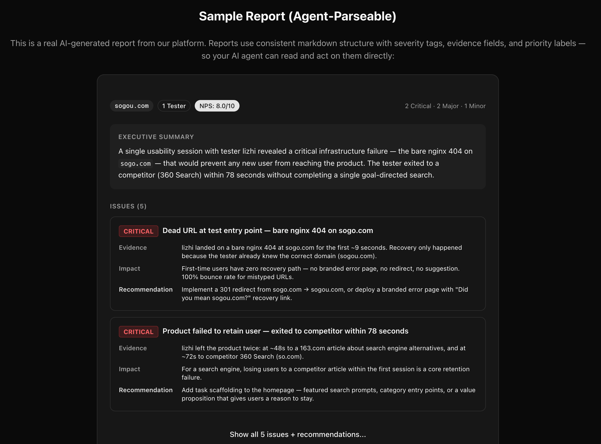
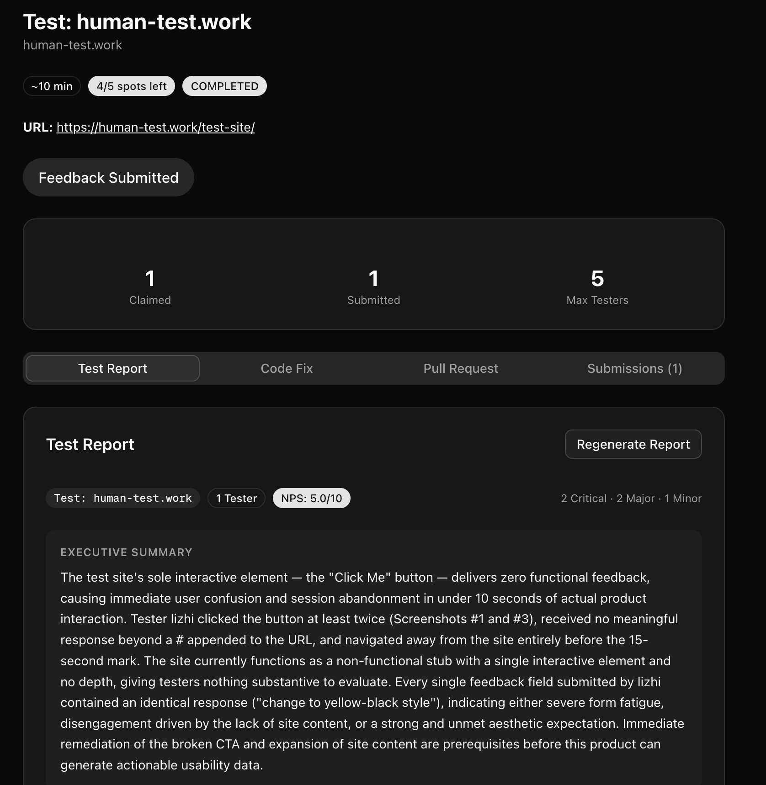
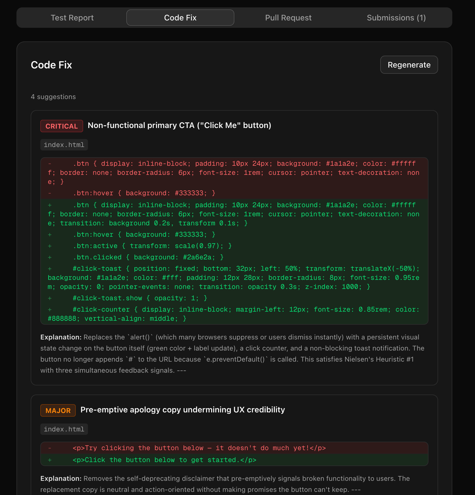

# human_test()

[](https://www.npmjs.com/package/humantest-app)
[](https://www.npmjs.com/package/humantest-app)
[](LICENSE)
[](https://nodejs.org/)
[](https://nextjs.org/)
[](https://www.typescriptlang.org/)
[](https://github.com/avivahe326/humantest/pulls)
[-8A2BE2)](https://github.com/avivahe326/human-test-skill)

AI builds your product in minutes. But can real users actually use it?

**human_test()** closes the loop — your AI agent calls real humans to test, gets a structured usability report, and auto-fixes the issues. No manual QA, no guesswork.

```
You:   "Test my app at localhost:3000, focus on the signup flow"
Agent: → calls human_test()
       → 5 real humans test your product (screen recording + audio narration)
       → AI analyzes recordings and generates a structured report
       → 3 critical issues found, auto-generates fixes, creates PR #42
```

<!-- TODO: Add screenshot of a real report or dashboard here -->
<!--  -->

## Quick Start

```bash
npm i -g humantest-app
humantest init
cd humantest
humantest start
```

Three commands. Local SQLite database, zero external dependencies. Open `http://localhost:3000` and create your first test task.

Or skip setup entirely — use the hosted version at **[human-test.work](https://human-test.work)**.

## AI Agent Integration

human_test() is designed as an **AI agent primitive** — not a dashboard for humans to interpret, but a structured API that agents can call, parse, and act on directly.

### Install as a skill

```bash
# Works with Claude Code, Cursor, Windsurf, etc.
npx skills add avivahe326/human-test-skill
```

Once installed, your agent can call `human_test()` in natural language:

> "Run a usability test on my checkout flow with 3 testers"

### Or call the API directly

```bash
curl -X POST http://localhost:3000/api/skill/human-test \
  -H "Content-Type: application/json" \
  -d '{
    "url": "https://your-product.com",
    "focus": "Test the onboarding flow",
    "maxTesters": 5
  }'
```

No authentication required for self-hosted instances.

## How It Works

1. **Create a task** — provide a URL (or description for mobile/desktop apps) and what to focus on
2. **Real humans test** — testers claim the task, record their screen + microphone, complete a guided feedback flow (first impression, task steps, NPS rating)
3. **AI generates a report** — extracts key frames from recordings, uses vision AI to analyze usability issues, aggregates all feedback into a structured, severity-ranked report
4. **Auto-fix (optional)** — if you provide a `repoUrl`, the platform clones your code, generates file-level fix suggestions, and creates a PR

<!-- TODO: Add a workflow diagram or screenshot here -->
<!--  -->

## Auto-Fix: From Report to PR

This is the closed-loop that makes human_test() different from traditional UX testing tools:

```
human_test() → real humans test → structured report
    → AI reads report issues → clones your repo
    → generates file-level diffs → creates a PR
```

Pass a `repoUrl` when creating a task:

```bash
curl -X POST http://localhost:3000/api/skill/human-test \
  -H "Content-Type: application/json" \
  -d '{
    "url": "https://your-product.com",
    "focus": "Test the checkout flow",
    "repoUrl": "https://github.com/your-org/your-repo",
    "webhookUrl": "https://your-server.com/webhook",
    "codeFixWebhookUrl": "https://your-server.com/code-fix-webhook"
  }'
```

**Two modes** (auto-detected based on GitHub permissions):
- **Read-only access** — get code fix suggestions as diffs in the report
- **Write access** — get an auto-created PR with the fixes applied

<!-- TODO: Add screenshot of an auto-generated PR here -->
<!--  -->

## Why Not UserTesting / Maze / etc.?

Traditional UX testing platforms are built for human product managers reviewing dashboards. human_test() is built for **AI agents writing code**:

- **Structured output** — severity-ranked issues with Evidence/Impact/Recommendation, designed for agents to parse and act on
- **Webhook-driven** — async notifications when reports and code fixes are ready
- **Auto-PR** — from usability issue to pull request, no human in the middle
- **Self-hostable** — runs locally with SQLite, your data stays on your machine
- **Open source** — MIT licensed, extend it however you want

## Report Format

Reports are structured markdown designed for AI agents to parse directly:

```markdown
## Metadata
| Field | Value |
|-------|-------|
| Product | Your App |
| Testers | 5 |
| Avg NPS | 7.2/10 |

## Executive Summary
(3-5 sentences, most critical finding first)

## Issues
### [CRITICAL] Signup button unresponsive on mobile
- **Evidence:** 3/5 testers couldn't complete registration on iPhone
- **Impact:** 60% of mobile users will abandon signup
- **Recommendation:** Fix touch target size, minimum 44x44px

### [MAJOR] Confusing pricing page layout
...

## Recommendations
- **P0** (fix immediately): Mobile signup button
- **P1** (fix this sprint): Pricing page clarity
- **P2** (next sprint): ...
```

Severity levels: `[CRITICAL]`, `[MAJOR]`, `[MINOR]`. Priority tags: `P0`–`P3`. Each issue has three fields: Evidence, Impact, Recommendation — giving your agent enough context to write a targeted fix.

## Parameters

| Parameter | Required | Default | Description |
|-----------|----------|---------|-------------|
| `url` | No | — | Product URL (leave empty for mobile apps or non-web products) |
| `focus` | No | — | What testers should focus on |
| `maxTesters` | No | 5 | Number of testers (1–50) |
| `repoUrl` | No | — | GitHub repo URL for auto-fix and PR creation |
| `repoBranch` | No | default | Branch to analyze |
| `webhookUrl` | No | — | URL to receive the report when ready |
| `codeFixWebhookUrl` | No | — | URL to receive code fix results |
| `creator` | No | admin | Agent/user name creating the task |
| `locale` | No | `en` | Report language: `en` or `zh` |

## CLI Commands

| Command | Description |
|---------|-------------|
| `humantest init` | Setup wizard (add `--non-interactive` for auto mode) |
| `humantest start` | Start the server |
| `humantest stop` | Stop the server |
| `humantest restart` | Restart the server |
| `humantest update` | Pull latest, rebuild, restart |
| `humantest status` | Check server status |
| `humantest logs` | View server logs |

<details>
<summary><strong>Configuration</strong></summary>

See [`.env.example`](.env.example) for all available variables.

| Variable | Required | Description |
|----------|----------|-------------|
| `DATABASE_URL` | Yes | SQLite (`file:./data/humantest.db`) or MySQL connection string |
| `NEXTAUTH_SECRET` | Yes | Random secret for session encryption |
| `NEXTAUTH_URL` | Yes | App URL (`http://localhost:3000` or your domain) |
| `AI_PROVIDER` | No | `anthropic` (default) or `openai` |
| `AI_API_KEY` | No | API key for AI report generation |
| `SMTP_HOST` | No | Enable email verification (skip = direct registration) |
| `OSS_REGION` | No | Object storage region (skip = store recordings on local disk) |
| `GITHUB_TOKEN` | No | Enable repo cloning and auto-PR |

The first registered user becomes admin and can change all settings from the web UI at `/settings`.

### Non-interactive setup

For automated/CI installs:

```bash
humantest init --non-interactive
```

Uses local mode (SQLite), auto-detects AI keys from environment (`ANTHROPIC_API_KEY`, `OPENAI_API_KEY`, `DEEPSEEK_API_KEY`, or `GEMINI_API_KEY`), port 3000. Creates a default admin user (`admin@humantest.local` / `admin`).

</details>

<details>
<summary><strong>Webhooks</strong></summary>

Two separate webhooks for the two stages:

### Report webhook (`webhookUrl`)

```json
{
  "event": "report",
  "taskId": "...",
  "status": "COMPLETED",
  "report": "## Executive Summary\n..."
}
```

### Code fix webhook (`codeFixWebhookUrl`)

```json
{
  "event": "code_fix",
  "taskId": "...",
  "status": "COMPLETED",
  "codeFixPrUrl": "https://github.com/user/repo/pull/1"
}
```

</details>

<details>
<summary><strong>Architecture</strong></summary>

```
Next.js 16 + Prisma + NextAuth + Tailwind CSS

├── app/                    # App router pages & API routes
│   ├── api/
│   │   ├── skill/          # AI agent skill API
│   │   ├── tasks/          # Task CRUD, claim, submit, report generation
│   │   ├── auth/           # Registration, login, email verification
│   │   └── settings/       # Admin platform settings
│   ├── tasks/              # Task list, detail, testing flow
│   └── settings/           # Admin settings page
├── lib/
│   ├── ai-report.ts        # Two-phase media + text analysis
│   ├── media-analysis.ts   # Video frame extraction + AI vision
│   ├── code-fixer.ts       # Repo-aware code fix + auto-PR
│   └── i18n/               # English + Chinese
├── prisma/schema.prisma    # Database schema (MySQL or SQLite)
├── skill/SKILL.md          # AI agent skill definition
└── cli/humantest.mjs       # CLI tool source
```

</details>

<details>
<summary><strong>Rate Limiting</strong></summary>

| Endpoint | Limit |
|----------|-------|
| Registration | 5/min per IP |
| Email verification | 3/min per IP |
| Task creation | 10/min per user |
| Skill API | 30/min per user |

</details>

## Manual Setup

If you prefer not to use the CLI:

```bash
git clone https://github.com/avivahe326/humantest.git
cd humantest
cp .env.example .env    # edit with your settings
npm install
npx prisma db push
npm run build
npm start
```

## License

MIT
